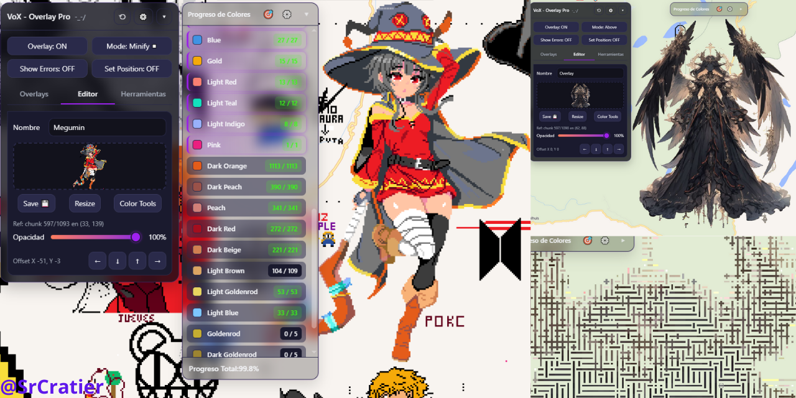
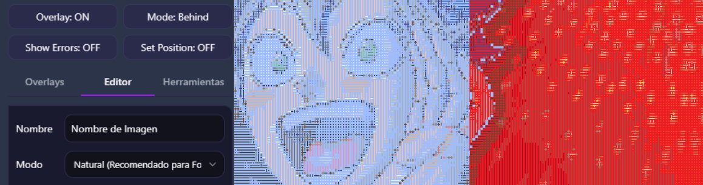

🌍 [Español](README.md) | [English](README-en.md) |[Français](README-fr.md)

# VoX - Overlay Pro pour Wplace
**Basé sur le code original de shinkonet, modifié et maintenu par @SrCratier.**

Un script utilisateur (userscript) avancé pour `wplace.live` qui permet de charger, positionner et gérer des modèles (overlays) sur la toile. Cette version a été optimisée pour offrir de meilleures performances, une plus grande précision dans la conversion des couleurs et des outils intégrés pour faciliter la création artistique et améliorer le confort de l'utilisateur.

---

## 1. Installation

Pour utiliser ce script, vous devez d'abord installer un gestionnaire de scripts dans votre navigateur.

### Navigateurs pris en charge

| Plateforme | Navigateurs recommandés |
| :--- | :--- |
| **PC / Mac** | Chrome, Firefox, Brave, Edge, Opera GX |
| **Mobile (Android/iOS)** | **Microsoft Edge (Recommandé)**, Kiwi Browser |

### Étapes d'installation
1. **Installez Tampermonkey** depuis la boutique d'extensions de votre navigateur :
   - [Tampermonkey pour Chrome/Brave/Edge](https://chrome.google.com/webstore/detail/tampermonkey/dhdgffkkebhmkfjojejmpbldmpobfkfo)
   - [Tampermonkey pour Firefox](https://addons.mozilla.org/fr/firefox/addon/tampermonkey/)
   > *Note pour les mobiles : Si vous utilisez Edge sur mobile, vous pouvez installer l'extension directement depuis le menu "Extensions" du navigateur.*

2.[**Cliquez ici pour installer le script (v5.2.5)**](https://raw.githubusercontent.com/SrCratier/Wplace_VoX-Overlay-Pro/main/WplacePro-VoX.user.js).
3. Tampermonkey ouvrira automatiquement un onglet demandant confirmation. Cliquez sur **Installer** ou **Mettre à jour**.

---

## 2. Guide d'utilisation

Suivez ces étapes pour placer votre dessin sur la toile avec la meilleure qualité visuelle possible.

### A. Créer et charger un Overlay
1. Ouvrez le panneau VoX dans Wplace et allez dans l'onglet **Overlays**.
2. Cliquez sur **+ Ajouter**, l'onglet **Editor** (Éditeur) s'ouvrira.
3. Choisissez votre **Mode de rendu** (voir section ci-dessous) ou utilisez celui par défaut (recommandé).
4. Chargez votre image : vous pouvez coller une **URL directe** et cliquer sur "Charger", ou cliquer sur la zone en pointillés pour uploader un **fichier local**.

### B. Modes de rendu des couleurs
Lors du chargement d'une image, le script la convertit automatiquement vers la palette officielle de Wplace. Vous pouvez choisir la manière dont ces couleurs sont traitées :
*   **Standard (Recommandé) :** Utilise un algorithme de couleur proche sans générer de bruit visuel. Idéal pour la grande majorité des conceptions, logos et formes plates.
*   **Amélioré (Pixel Art) :** Force une correspondance mathématique directe des couleurs (distance Euclidienne). C'est le mode le plus précis pour le Pixel Art strict et les bords nets.
*   **Photoréaliste (Dithering) :** Distribue l'erreur de conversion des couleurs entre les pixels adjacents pour simuler des transitions et des dégradés doux. Utile principalement pour les photographies ou les images complexes.

### C. Fixer la position (Ancrer)
1. Une fois l'image chargée, cliquez sur le bouton supérieur **Set Position: OFF** (il passera sur **ON**).
2. Cliquez sur la toile du jeu, exactement sur le pixel où vous souhaitez que le coin supérieur gauche (0,0) de votre image soit placé.
3. Le script ancrera automatiquement l'image. Vous pouvez effectuer des micro-ajustements à l'aide des flèches de déplacement dans la section "Offset X / Y" de l'éditeur.
   > *Note : L'image ne sera ancrée que si la palette de couleurs est fermée.*

### D. Panneau principal et modes d'affichage
Depuis les boutons en haut du panneau, vous pouvez contrôler la façon dont votre modèle est projeté :
*   **Overlay (ON/OFF) :** Affiche ou masque tous vos modèles chargés.
*   **Mode :** Modifie le style d'affichage du modèle :
    *   *Minify (Recommandé) :* Affiche l'image sous la forme d'un motif de points espacés, vous permettant de voir la toile originale en dessous.
    *   *Behind / Above :* Projette l'image de manière totalement solide derrière (Behind) ou au-dessus (Above) des pixels de la carte.
    *   *Original :* Masque temporairement l'overlay pour observer la vraie carte.
*   **Show Errors (ON/OFF) :** Met en évidence les pixels de la carte qui ne correspondent pas à votre dessin en utilisant des couleurs contrastées.

> **💡 Note de performance :** Si vous modifiez l'opacité, la position ou appliquez des filtres, déplacez simplement un peu la carte ou placez un pixel pour rafraîchir l'écran et appliquer les modifications.

---

## 3. Outils supplémentaires

Le script inclut des fonctions de gestion et d'édition dans leurs onglets respectifs.

### Onglet Outils (Tools)
*   **Copier la toile (Copy Canvas) :** Télécharge une découpe exacte et propre de la carte actuelle au format PNG.
    1. Fixez le **Point A** en cliquant sur un coin.
    2. Fixez le **Point B** sur le coin opposé.
    3. Activez "Aperçu de la zone" et cliquez sur "Télécharger".
*   **Analyse de progression (Color Analysis) :** Ouvre un panneau flottant pour le suivi en temps réel de votre projet.
    *   Calcule le pourcentage total de progression de votre overlay.
    *   Affiche une liste du nombre de pixels manquants, triés par couleur.
    *   Permet d'appliquer des filtres visuels pour afficher ou masquer des couleurs spécifiques, facilitant ainsi le travail d'équipe par zones ou teintes.

### Onglet Éditeur (Editor)
*   **Outils de couleur (Color Tools) :** Ajuste et remplace les couleurs de votre modèle par d'autres de la palette officielle de Wplace avant de commencer à dessiner.
*   **Redimensionner (Resize) :** Outil intégré pour mettre à l'échelle votre conception en interne sans avoir besoin d'un logiciel externe.

---

## 4. Caractéristiques techniques

Cette version a été réécrite pour offrir une expérience plus fluide et plus stable :

*   **Traitement Asynchrone (Web Workers) :** La conversion des images complexes s'exécute en arrière-plan, empêchant le navigateur de geler (Anti-Lag) pendant le chargement.
*   **Prise en charge de la Haute Résolution :** La limite de taille pour les overlays a été augmentée, supportant des images allant jusqu'à **3000x3000px**.
*   **Gestion Multi-Overlay Indépendante :** Vous pouvez garder plusieurs modèles chargés en même temps. Chaque overlay enregistre sa propre position, son opacité et ses paramètres de filtre de couleur sans entrer en conflit avec les autres.
*   **Optimisation de la Mémoire :** Implémentation d'une limite de cache pour les données de la carte, réduisant considérablement la consommation de RAM lors de longues sessions.
*   **Détection d'Erreurs Améliorée :** La logique de détection des pixels sombres/noirs a été corrigée et ajustée, garantissant un affichage clair des erreurs, quelle que soit la teinte.

---

## 5. Support et Remerciements

Dans l'en-tête du panneau principal, vous trouverez le bouton **Paramètres (⚙️)**, où vous pouvez :
*   Basculer l'interface entre les thèmes **Clair** (Light) et **Sombre** (Dark).
*   Ajuster la transparence globale du panneau.

Ce projet est open source (GPLv3) et sa maintenance demande du temps. Si le script vous a été utile pour organiser votre communauté ou défendre votre art, pensez à soutenir le développeur.

Vous trouverez les détails pour faire un don (Binance / PayPal) ainsi que la liste de remerciements aux contributeurs récents dans le menu des paramètres.
