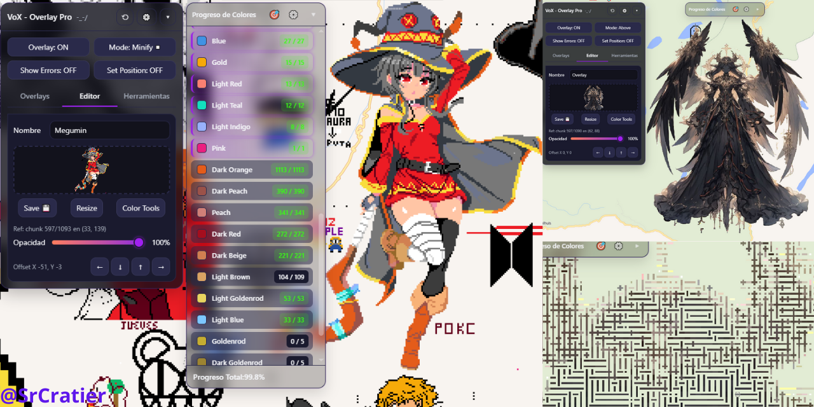
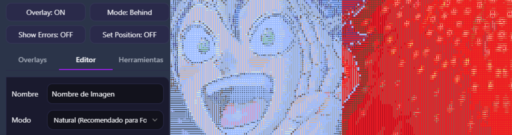

# VoX - Overlay Pro: Guía de Usuario Completa -_- /
**Basado en el código de shinkonet, adaptado y mejorado para Wplace.**
**Based on shinkonet’s code, adapted and enhanced for Wplace.**

¡Bienvenido a **VoX - Overlay Pro v5.0.1**!
Esta guía te ayudará a dominar todas las herramientas que el script pone a tu disposición. Hemos actualizado el motor para que sea más inteligente, rápido y fácil de usar.

---

## **1. Instalación**

Para usar el script, primero necesitas una extensión de navegador llamada **Tampermonkey**.

### Navegadores Soportados

| Plataforma | Navegadores Recomendados |
| :--- | :--- |
| **PC / Mac** | Chrome, Firefox, Brave, Edge, Opera GX |
| **Móvil (Android/iOS)** | **Microsoft Edge (Recomendado)**, Kiwi Browser |

1. **Instala Tampermonkey:**

   - [Tampermonkey para Chrome/Brave/Edge](https://chrome.google.com/webstore/detail/tampermonkey/dhdgffkkebhmkfjojejmpbldmpobfkfo)
   - [Tampermonkey para Firefox](https://addons.mozilla.org/es/firefox/addon/tampermonkey/)

   **📱 Nota para Móviles:** Si usas Edge en el móvil, puedes instalar la extensión directamente desde el menú "Extensiones" del navegador.

2. **Instala el Script:**
   El script está configurado para actualizarse automáticamente.
   
   [**⬇️ Haz clic aquí para instalar el Script (v5.0.1)**](https://raw.githubusercontent.com/SrCratier/Wplace_VoX-Overlay-Pro/main/WplacePro-VoX.user.js)

   Tampermonkey se abrirá automáticamente y te pedirá confirmación. Dale a "Instalar".

---

## **2. Tu Primer Overlay: Pasos Esenciales**

Sigue estos pasos para colocar tu diseño sobre el lienzo con la mejor calidad de color posible.

**Paso 1: Crear y Configurar**
1.  Abre el panel de VoX en Wplace.
2.  Ve a la pestaña **Overlays** y haz clic en **+ Add**.
3.  Ve a la pestaña **Editor**.

**Paso 2: Elegir el Modo de Color (¡NUEVO!)**
Antes de cargar tu imagen, selecciona el **Modo** que mejor se adapte a tu diseño en el menú desplegable:
*   **🌿 Natural:** (Por defecto) Ideal para fotografías, memes y degradados suaves.
*   **⚡ Vibrante:** Perfecto para logotipos, textos y colores neón brillantes.
*   **💀 Intenso (Anime):** Un modo matemático pesado que prioriza el tono exacto (HSV). Úsalo para Pixel Art complejo o Anime. (🚨Precaución : Este modo de renderizado es MUY PESADO y podría arruinar tu progreso!)

**Paso 3: Cargar la Imagen**
*   **Desde URL:** Pega el enlace directo y clic en **Cargar**.
*   **Archivo Local:** Clic en el cuadro punteado para subirla desde tu dispositivo.
    *(El script procesará los colores automáticamente para eliminar errores).*

**Paso 4: Anclar al Lienzo**
1.  Haz clic en el botón **Set Position: OFF** (cambiará a **ON**).
2.  Haz clic en el lienzo del juego, exactamente en el píxel donde quieres que empiece la esquina superior izquierda (0,0) de tu imagen.
3.  ¡Listo! La imagen se fijará.

---

## **3. Panel Principal y Modos de Visualización**

- **Overlay: ON/OFF** → Muestra u oculta todos tus diseños.
- **Mode: Minify** → Cambia la visualización del Overlay:
  - *Minify (Recomendado):* Muestra puntos pequeños sobre el lienzo (patrón) para ver debajo.
  - *Behind/Above:* Muestra la imagen completa detrás o delante del lienzo.
  - *Original:* Oculta el overlay para ver el mapa real.
- **Show Errors: ON/OFF** → Marca en rojo brillante los píxeles que no coinciden con tu diseño.

> **💡 Consejo de Rendimiento:** Ya no existe el botón de "Recargar". Si cambias la opacidad, posición o filtros, el script te avisará. Solo tienes que **mover un poco el mapa** o pintar un píxel para ver los cambios.

---

## **4. Funciones Avanzadas por Pestaña**

### **Pestaña Overlays**
*   **Gestión Individual:** Ahora, cada Overlay guarda su propia configuración de filtros de colores. Puedes tener varios activos con configuraciones diferentes.

### **Pestaña Editor**
*   **Opacidad:** Controla la transparencia del Overlay.
*   **Ajuste Fino (Nudge):** Usa las flechas para mover la imagen píxel por píxel si la posición inicial no fue precisa.
*   **Capacidad:** ¡Soporte para imágenes de hasta **3000x3000px**!

### **Pestaña Herramientas**
*   **Copiar Lienzo:** 
    1. Fija el **Punto A**.
    2. Fija el **Punto B**.
    3. Clic en **Detectar y Descargar** para obtener una copia exacta de esa área del lienzo.

*   **Mostrar Progreso del Overlay:** Abre un panel flotante para el seguimiento en tiempo real.
    *   **Lista de Colores:** Muestra cuántos píxeles faltan de cada color.
    *   **Filtros (⚙️):** Puedes ocultar colores terminados o filtrar la lista para delegar tareas.
    *   **Optimización:** El panel ahora carga de forma instantánea sin congelar el navegador.

---

## **5. Soporte y Agradecimientos**

En la cabecera del panel encontrarás el botón de **Ajustes (⚙️)**:
- **Tema:** Cambia entre modo Claro y Oscuro.
- **Transparencia:** Ajusta la opacidad del panel.

**❤️ Apoya el Proyecto**
Este script es gratuito y se mantiene gracias a la comunidad. Si te ha sido útil para defender tu arte, considera apoyar el desarrollo con una donación (encontrarás la opción en los menús de ajustes).

---

¡Disfruta creando en **wplace.live** con VoX Overlay Pro! 🚀
Sinceramente no tenía intención de terminarlo, pero tuve un golpe de creatividad y aquí tienen. (no creo que publique más actualizaciones) a no ser que sean para actualizar compatibilidad.
